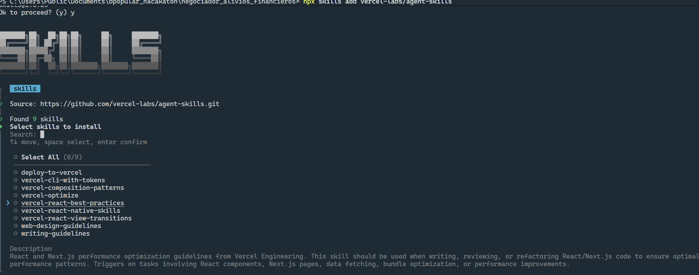

# Reto: Dashboard de Conciliación "Switch vs. Core"

## Contexto

Una entidad financiera procesa diariamente transacciones desde cajeros automáticos y pasarelas de pago.

En algunas ocasiones, un cliente solicita un retiro y ocurre una falla de comunicación: el sistema central bancario (**Core**) descuenta el dinero, pero el cajero o la pasarela, administrados por el **Switch**, no completan la entrega o no registran correctamente la transacción.

Estas diferencias producen “transacciones huérfanas” que actualmente deben ser identificadas y conciliadas manualmente por un analista al día siguiente.

La aplicación debe simular un portal de auditoría que permita cargar los registros de ambos sistemas, compararlos, detectar discrepancias, explicar su posible causa y presentar los casos al analista para que tome una decisión.

## Objetivo

Construir una SPA (Single Page Application) moderna y responsiva que permita:

* Cargar los archivos CSV del Core bancario y del Switch.
* Validar la estructura y contenido de ambos archivos.
* Conciliar las transacciones usando su identificador único.
* Detectar transacciones coincidentes, huérfanas, duplicadas o inconsistentes.
* Mostrar indicadores y visualizaciones de la conciliación.
* Presentar una explicación comprensible de cada discrepancia.
* Permitir que un analista apruebe o rechace manualmente una propuesta de reverso.
* Mantener siempre una intervención humana antes de cambiar el estado de un caso.

La aplicación es una demostración: no debe conectarse a sistemas bancarios reales ni ejecutar movimientos financieros.

## 3. Alcance Técnico

Construye una aplicación exclusivamente frontend. Todo el procesamiento debe realizarse localmente en el navegador.

Incluye las siguientes capacidades:

### Carga de archivos

* Crear una zona de carga independiente para cada CSV, mediante selección de archivo o drag and drop.
* Mostrar nombre, tamaño, cantidad de registros y estado de validación.
* Permitir reemplazar o eliminar un archivo antes de procesarlo.
* Habilitar el botón **“Ejecutar conciliación”** únicamente cuando ambos archivos sean válidos.
* Utilizar una librería como Papa Parse para procesar los CSV.
* Validar los archivos al momento de la carga.

### Motor de conciliación (sugerido)

Usar `transaction_id` como clave principal y clasificar cada operación en una de estas categorías:

1. **Conciliada:** existe en ambos sistemas y coinciden monto, moneda y resultado.
2. **Huérfana en Switch:** fue aprobada o debitada en Core, pero no existe en Switch.
3. **Rechazada en Switch:** fue aprobada en Core, pero aparece rechazada o fallida en Switch.
4. **Huérfana en Core:** aparece como aprobada en Switch, pero no existe en Core.
5. **Monto inconsistente:** existe en ambos sistemas, pero el monto no coincide.
6. **Estado inconsistente:** existe en ambos sistemas, pero los estados son incompatibles.
7. **Duplicada:** el mismo `transaction_id` aparece más de una vez en alguno de los archivos.

### Explicación de discrepancias (sugerido)

Generar una explicación determinística y legible a partir de los datos disponibles. Por ejemplo:

* “El Core registró y aprobó el débito, pero no se encontró la transacción correspondiente en el Switch. Posible interrupción de comunicación antes de que el Switch registrara la operación.”
* “El Core aprobó la transacción, pero el Switch la reportó como rechazada con el código 91. Se requiere validar si el efectivo fue entregado.”
* “La transacción aparece en ambos sistemas, pero presenta una diferencia de $50.000 en el monto.”
* “El Switch reportó una operación aprobada que no tiene registro equivalente en el Core.”

No presentar una causa como un hecho confirmado si los archivos no contienen suficiente evidencia. Utilizar expresiones como **“posible causa”**, **“indicio”** o **“requiere validación”**.

### Dashboard

Después de ejecutar la conciliación, mostrar:

* Total de transacciones procesadas.
* Transacciones conciliadas.
* Discrepancias detectadas.
* Monto total afectado.
* Casos pendientes de revisión.
* Casos aprobados y rechazados.

Crear con Recharts:

* Gráfico de dona con la distribución por resultado.
* Gráfico de barras con discrepancias por tipo.
* Gráfico de líneas o área con transacciones y discrepancias por fecha u hora.
* Tooltips, leyendas y colores consistentes con la severidad.

### Gestión de casos

Crear una tabla de discrepancias con:

* ID de transacción.
* Fecha y hora.
* Tipo de discrepancia.
* Monto.
* Estado en Core.
* Estado en Switch.
* Nivel de riesgo.
* Estado de revisión.
* Acción para ver el detalle.

Incluir:

* Búsqueda por ID.
* Filtros por tipo, riesgo, estado y fecha.
* Ordenamiento.
* Paginación.
* Estado vacío cuando no existan resultados.
* Botón para exportar las discrepancias visibles a CSV.

Al seleccionar una fila, abrir un panel lateral o modal con:

* Datos registrados por el Core.
* Datos registrados por el Switch.
* Campos que no coinciden resaltados.
* Explicación de la posible causa.
* Código y mensaje de error, cuando estén disponibles.
* Recomendación de acción.
* Historial local de decisiones.

## Stack Tecnológico (sugerido)

Utiliza:

* React.
* TypeScript con modo estricto.
* Vite.
* Tailwind CSS.
* Recharts.
* Lucide React.
* Papa Parse para leer y generar CSV.
* React hooks para el manejo de estado.

Puedes utilizar `localStorage` para conservar temporalmente los resultados y decisiones del analista. No implementes backend, base de datos, autenticación ni llamadas a APIs externas.

## Archivos de Entrada

La aplicación debe trabajar con estos archivos:

### `log_core_bancario.csv`

Representa las transacciones procesadas por el sistema central.

Columnas esperadas:

```csv
transaction_id,timestamp,account_id,amount,currency,status,response_code
TX-1001,2026-08-31T08:15:20,****4521,350000,COP,APPROVED,00
```

Campos obligatorios:

* `transaction_id`
* `timestamp`
* `account_id`
* `amount`
* `currency`
* `status`
* `response_code`

### `log_switch.csv`

Representa las transacciones registradas por los cajeros o pasarelas.

Columnas esperadas:

```csv
transaction_id,timestamp,terminal_id,amount,currency,status,response_code,error_message
TX-1001,2026-08-31T08:15:22,ATM-023,350000,COP,APPROVED,00,
```

Campos obligatorios:

* `transaction_id`
* `timestamp`
* `terminal_id`
* `amount`
* `currency`
* `status`
* `response_code`

El campo `error_message` puede ser opcional.

Estados reconocidos:

* `APPROVED`
* `REJECTED`
* `FAILED`
* `PENDING`
* `REVERSED`

Normaliza espacios, mayúsculas y minúsculas antes de comparar. No muestres números completos de cuentas ni información financiera sensible.

## Flujo Sugerido

Implementa el siguiente recorrido:

1. El usuario abre la aplicación y ve una explicación breve del proceso.
2. Carga `log_core_bancario.csv`.
3. Carga `log_switch.csv`.
4. La aplicación valida ambos archivos y muestra un resumen.
5. El usuario selecciona **“Ejecutar conciliación”**.
6. La aplicación procesa los archivos localmente.
7. Se muestra el dashboard con indicadores, gráficos y resultados.
8. El usuario filtra las discrepancias.
9. Selecciona una transacción para consultar su detalle.
10. La aplicación muestra la comparación, posible causa y recomendación.
11. El analista decide aprobar o rechazar el reverso.
12. La decisión queda registrada localmente y los indicadores se actualizan.
13. El usuario puede exportar las discrepancias y decisiones a CSV.
14. Debe existir una opción para limpiar los resultados y comenzar una nueva conciliación.

## Human-in-the-loop

La aplicación nunca debe ejecutar ni simular automáticamente un reverso definitivo.

Toda discrepancia debe iniciar con el estado **“Pendiente de revisión”**.

En el detalle del caso incluye:

* Botón **“Aprobar reverso”**.
* Botón **“Rechazar reverso”**.
* Campo obligatorio para observaciones del analista.
* Confirmación explícita antes de registrar la decisión.
* Nombre del analista simulado o configurable.
* Fecha y hora de la decisión.
* Motivo de la decisión.
* Estado final: `PENDING_REVIEW`, `APPROVED_REVERSAL` o `REJECTED_REVERSAL`.

No permitir que un caso ya decidido sea modificado sin utilizar una acción explícita de **“Reabrir caso”**, acompañada de una nueva confirmación y registro en el historial.

## Criterios de Aceptación

La solución se considera terminada cuando:

* El proyecto ejecuta correctamente con `npm install` y `npm run dev`.
* No presenta errores de TypeScript ni errores relevantes en la consola.
* Permite cargar los dos CSV mediante selector o drag and drop.
* Rechaza archivos con estructura inválida y explica el problema.
* Procesa los archivos completamente en el navegador.
* Concilia las transacciones por `transaction_id`.
* Detecta las siete categorías de resultado definidas.
* Calcula correctamente las métricas y el monto afectado.
* Muestra como mínimo tres visualizaciones funcionales con Recharts.
* Presenta una tabla con búsqueda, filtros, ordenamiento y paginación.
* Permite consultar la comparación detallada de una discrepancia.
* Genera explicaciones basadas únicamente en la evidencia de los archivos.
* Diferencia visualmente operaciones conciliadas, advertencias y casos críticos.
* Ningún reverso se aprueba automáticamente.
* Aprobar o rechazar requiere observación y confirmación humana.
* Las decisiones actualizan inmediatamente las métricas y el historial.
* Los resultados y decisiones pueden exportarse a CSV.
* La interfaz es responsiva, accesible y mantiene una apariencia profesional.
* Se incluyen estados vacíos, de carga, de éxito y de error.
* El código está organizado en componentes y módulos reutilizables.
* El repositorio incluye un `README.md` con instrucciones de instalación, ejecución, formato de los CSV y explicación de las reglas de conciliación.

## Consideraciones Adicionales

* Incluir validaciones de seguridad, por ejemplo, no mostrar información de un cliente distinto al seleccionado o no incluir datos bancarios reales.
* Incluir manejo de errores.
* Utilizar fuentes, colores, imágenes alusivas a Banco Popular.

### Skill recomendado para React

Como sugerencia, se recomienda instalar el skill `vercel-react-best-practices` para orientar la implementación y revisión del código React según las prácticas de rendimiento de Vercel Engineering.

Ejecutar el siguiente comando desde la raíz del proyecto:

```bash
npx skills add vercel-labs/agent-skills
```

En el selector interactivo, marcar `vercel-react-best-practices` con la barra espaciadora y confirmar la instalación con Enter, como se muestra en el siguiente ejemplo:


